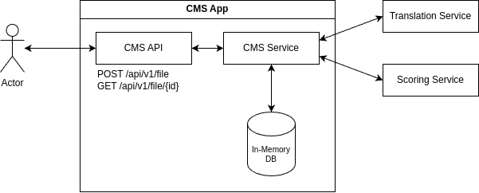
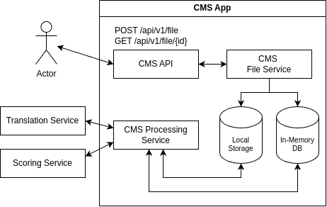
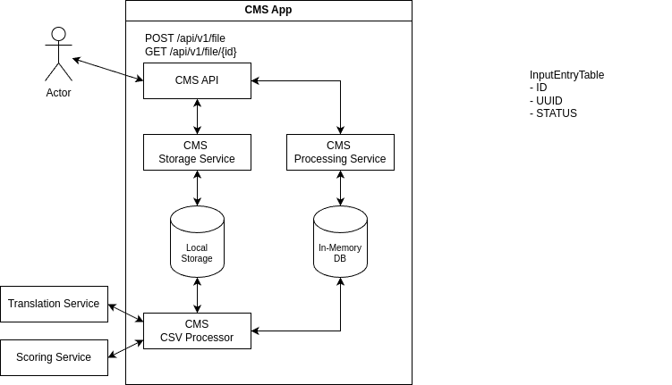

# Content Moderation System

An app developed as a technical test with preconditions and specific requirements.

## Preconditions & Assumptions

- The app needs to perform well even for large input data files with millions of entries;
- The mocked services will have network latencies (random values between 50ms to 200ms);
- The mocked services are idempotent;
- The app will persist the partial results into a database;

## Content Moderation System Design

### Initial Design



### First Iteration



### Second Review



### API Endpoints

```
POST /content-moderation-system/api/v1/file
```

The user or third-party will use this endpoint to upload a CSV file and will get a unique identifier to check job status
or result later.

#### Request

file="path_to_your_file.csv"

#### Response

```json
{
  "id": "2d14c3ca-d8ca-446a-8357-11d1623f0a82"
}
```

---

```
GET  /content-moderation-system/api/v1/file/{id}
```

The user will use the id to retrieve the job result as CSV. However, the job might take more time in case of huge input
files. Hence, the endpoint will return an IN_PROGRESS status until the job is done.

#### Response (IN_PROGRESS)

```json
{
  "id": "2d14c3ca-d8ca-446a-8357-11d1623f0a82",
  "status": "IN_PROGRESS"
}
```

#### Response (READY)

CSV content.

### Database

The app will store the partial results into a database in order to be able to create the required statistics of the
outfile file.

## Translation Service (mocked)

The service will have a fake latency to simulate a real-world scenario with a random value for each request.

### API Endpoints

```
GET /translation-service/api/v1/translation
```

#### Request

```json
{
  "originalMessage": "Este es un texto para ser puntuado"
}
```

#### Response

```json
{
  "originalMessage": "Este es un texto para ser puntuado",
  "translatedMessage": "This is a text to be scored"
}
```

## Scoring Service (mocked)

The service will have a fake latency to simulate a real-world scenario with a random value for each request.

### API Endpoints

```
GET /scoring-service/api/v1/score 
```

#### Request

```json
{
  "message": "This is a text to be scored"
}
```

#### Response

```json
{
  "message": "This is a text to be scored",
  "score": 0.8
}
```

# How to Build & Run It

```shell
./gradlew bootRun
```

The best would be to use a REST client as Insomnia or Postman to test the API endpoints.

To provide the endpoint with a file to process.

```shell
curl --request POST \
  --url http://localhost:8080/api/v1/file \
  --header 'Content-Type: multipart/form-data' \
  --form 'file=@/home/rbreje/dev/workspaces/personal-workspace/content-moderation-system/Input Samples/input1.csv'
```

To retrieve the outfile or check the status.

```shell
curl --request GET \
  --url http://localhost:8080/api/v1/file/ab8f2571-f107-4c4b-94ed-dcea2890360a \
  --header 'Content-Type: multipart/form-data; boundary=---011000010111000001101001'
```

# TODOs

- [x] Create initial design and implementation plan;
- [x] Create the base project;
- [x] Implement the mocked services related stuff;
- [x] Implement storage mechanism of the input files;
- [x] Create database to store each input file;
- [x] Implement the API endpoint to store the input files;
- [x] Implement the API endpoint to download the output files;
- [X] Implement the business logic with concurrence execution;
- [ ] Add SonarCloud analysis;

# Further features

- Retry mechanism for failed connections to third-party services;